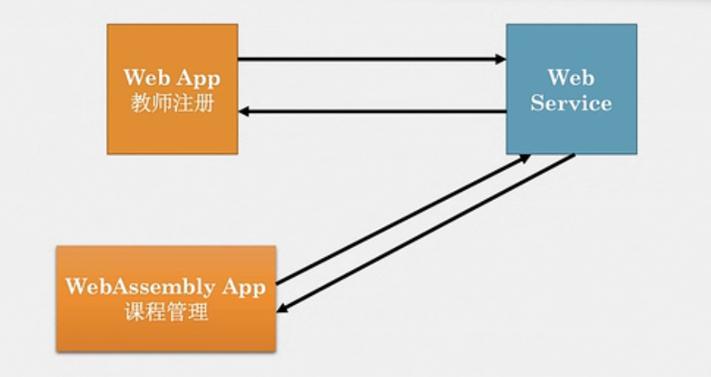
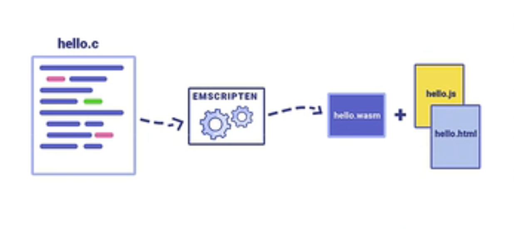

# 学习 rust - actix 框架项目

## webservice/src/bin/server1


Actix 支持两类并发

1. 异步 I/O
2. 多线程并行

## 错误处理


- 建立自定义错误类型，统一化错误，返回 HttpResponse
- 返回 Result 枚举类型
  ```
  enum Result<T,E> {
      Ok(T),
      Err(E),
  }
  ```
- 利用`?`运算符 传播错误
- Actix-web 错误类型
  `actix_web::error::Error`实现`std::error::Error`trait
  - 可以被`?`传播
  - 此类型自动转换为`HTTP Response`

#### 具体实现

- 创建自定义错误类型
- 实现 From trait，用于将其它错误类型转换为该类型
- 为自定义错误类型实现 ResponseError Trait
- 在 handler 里返回自定义错误类型
- Actix 把错误转换为 HTTP 相应

## 重构

- 更改目录结构
- 增加功能

# WASM 应用开发


[tutorial](https://rustwasm.github.io/docs/book/)

[教程](http://llever.com/rustwasm-book/)

- Assembly(汇编语言)
  - Assembly（接近机器码） ---ASSEMBLER--> maching code（机器码、计算机可直接执行）
  - 不同 CPU 架构需要不同机器码
  - 高级语言可以翻译成不同机器码
- WebAssembly
  - 伪汇编语言，针对浏览器
  - 中间编译器目标
  - 文件格式
    - 文本格式 .wat
    - 二进制格式 .wasm
- WASM 主要目标
  - 将 rust\c\c++等编译成 wasm 模块
  - Web 应用通过 JS 调用 wasm 模块
  - wasm 一般无法直接访问浏览器 API（DOM， WebGL...）     
    
