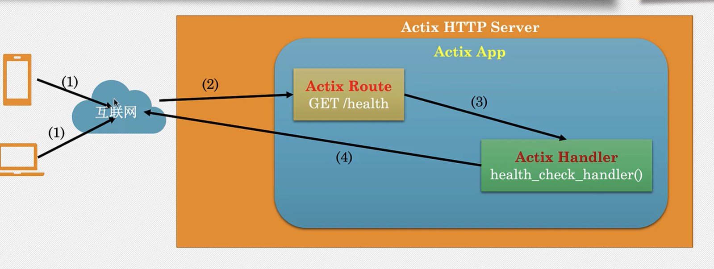
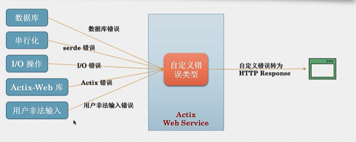

# 学习 rust - actix 框架项目

## webservice/src/bin/server1



Actix 支持两类并发

1. 异步 I/O
2. 多线程并行

## 错误处理



- 建立自定义错误类型，统一化错误，返回 HttpResponse
- 返回 Result 枚举类型
  ```
  enum Result<T,E> {
      Ok(T),
      Err(E),
  }
  ```
- 利用`?`运算符 传播错误
- Actix-web 错误类型
  `actix_web::error::Error`实现`std::error::Error`trait
  - 可以被`?`传播
  - 此类型自动转换为`HTTP Response`

#### 具体实现

- 创建自定义错误类型
- 实现 From trait，用于将其它错误类型转换为该类型
- 为自定义错误类型实现 ResponseError Trait
- 在 handler 里返回自定义错误类型
- Actix 把错误转换为 HTTP 相应
